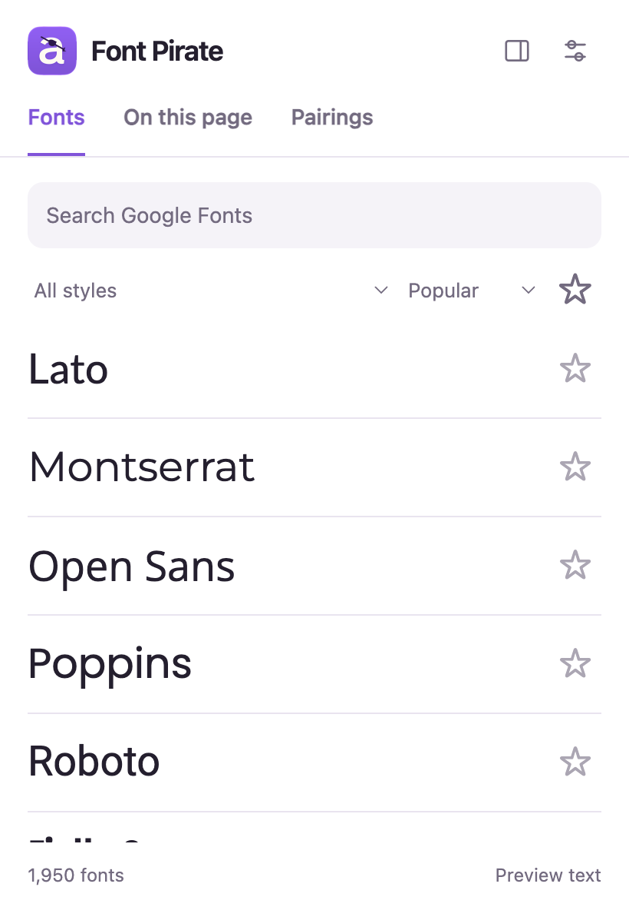
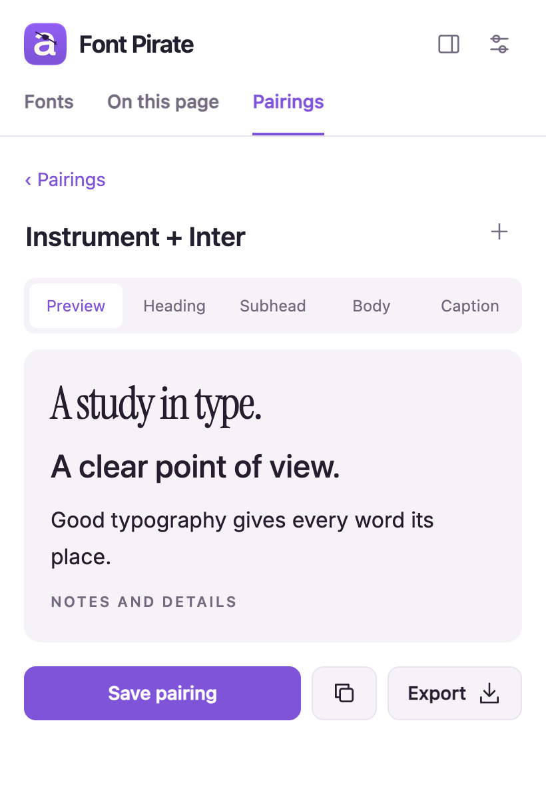

<div align="center">
  
  <h1>Font Pirate</h1>
  <p>Good type is out there.</p>
  <p>Google Fonts, page inspection and saved pairings for Chrome and Edge.</p>
  <p><a href="https://stefanmihajlovic.com/font-pirate/">Website</a> · <a href="https://github.com/Stefan-Mihajlovic/Font-Pirate">GitHub</a></p>
</div>

<p align="center"></p>

## Find your font

Browse all **1,950 Google Fonts** in the bundled October 2026 catalog. Search, filter by style, star favorites and preview your own text. Font files load when needed, so opening the extension doesn't download the whole library.

## Identify type on the web

Select text and choose **Identify font** from the right-click menu. Or choose **Pick a font…**, then click the text you want. The inspector reads the CSS family, weight, size, line height and spacing. Press Escape to stop picking.

## Put fonts together

Add fonts to a heading, body, subheading or caption. Preview the combination, save it, copy CSS, or export CSS/JSON. Existing Type Pilot libraries and JSON backups remain compatible.

## Font Pirate Plus

**$9.99 USD at launch, later $14.99. One-time purchase, up to three active installations.**

- **Similar fonts:** compare letter shapes across the bundled Google Fonts index.
- **Try on this page:** temporarily replace all text, headings or body text with a Google Font. Press Escape on the page or choose Restore page fonts to undo.
- **Match an image:** crop one line and transcribe 3–32 Latin letters or digits. Matching runs locally against 1,945 Google Fonts; images never leave your device. Results are approximate suggestions, not guaranteed identification. Connected handwriting, complex backgrounds and commercial fonts outside Google Fonts are not supported.

Buy from the [website](https://stefanmihajlovic.com/font-pirate/#plus), save the key shown after checkout, and enter it under **Plus → Activate**. An installation can be deactivated to free a slot. Signed entitlements allow up to seven days between online checks. See the [Plus terms](https://stefanmihajlovic.com/font-pirate/terms.html).

## Install for development

1. Clone this repository or download its source ZIP and unzip it.
2. Open `edge://extensions` or `chrome://extensions` and enable **Developer mode**.
3. Choose **Load unpacked** and select the folder containing `manifest.json`.
4. Pin **Font Pirate**. Reload the extension after local changes.

The extension is named **Font Pirate** (version 2.1.0). See the [website](https://stefanmihajlovic.com/font-pirate/) for downloads and product details. The GitHub repository is `Stefan-Mihajlovic/Font-Pirate`. Existing development checkouts can keep their original folder path so their unpacked extension ID and saved data remain unchanged.

## Privacy and previews

- Pairings, favorites and image matching stay on your device. No account, analytics or telemetry.
- Plus activation sends a license key, random installation ID and extension version to the licensing service. Stripe handles payment; the extension never receives card details. See the [privacy policy](https://stefanmihajlovic.com/font-pirate/privacy/).
- Google font stylesheets and font files are loaded from `fonts.googleapis.com` and `fonts.gstatic.com`. These requests include the font family and style, never your preview text or captured text.
- The bundled catalog works offline; remote font previews need a connection or browser cache. An unavailable preview is reported rather than presented as an exact font.
- Page access uses `activeTab`, granted by a toolbar click, shortcut or context-menu command. There is no always-running content script or access to every website.
- **Identify font** reads the start of the selected text. If a selection spans multiple styles, inspect each separately. **Pick a font…** starts the on-page picker.
- Identification reports the CSS family stack. It cannot prove which fallback rendered each glyph. Plus provides a separate approximate image-matching tool. Non-Google web fonts may preview using a local fallback. Captured CSS remains exact.
- Browser internal pages, PDF viewers and inaccessible cross-origin frames cannot be inspected.

## Development

Vanilla HTML, CSS and JavaScript. Manifest V3, Chrome/Edge 116+.

```sh
npm test
npm run package
```

The package is `dist/font-pirate-2.1.0.zip`. It includes the complete catalog and all runtime files. The generated ZIP is ignored by Git. Packaged previews include the Chrome store public key for a stable extension ID; the source manifest omits it to preserve existing local development installations.

### Refresh the catalog

```sh
curl --fail --location https://fonts.google.com/metadata/fonts -o /tmp/google-fonts-metadata.json
python3 scripts/update-fonts.py /tmp/google-fonts-metadata.json
```

Catalog facts come from [Google Fonts](https://fonts.google.com/). Fonts retain their respective licenses; open each family's Google Fonts page for its license and downloads. The extension does not bundle font binaries. Do not send user text through the CSS API's `text` parameter.

### Refresh the shape index

Install Playwright as a development tool, then run `node scripts/build-font-signatures.cjs`. Set `FONT_PIRATE_BROWSER` to a Chromium browser executable when no Playwright browser is installed. The generator resumes from a scratch cache and uses only a fixed public character sample. It does not upload user text or images, and it bundles descriptors rather than font binaries.

### Icon

The custom letter and eyepatch live in `assets/font-pirate/FontPirate.icon`. The document was opened, adjusted and exported in **Apple Icon Composer**. Export a 1024px PNG to `assets/font-pirate/font-pirate-composer.png`, then run:

```sh
python3 scripts/resize-icons.py
```

Design rationale and sources: [DESIGN.md](DESIGN.md).

## License

Proprietary. All rights reserved. The official unmodified preview may be used for personal evaluation. See [LICENSE](LICENSE).
